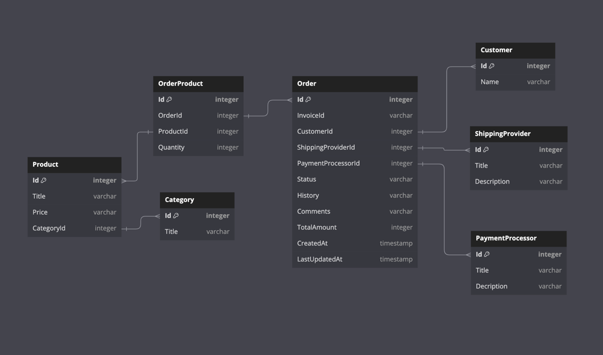

So we are implementing the typical web shop. I can propose the next structure of the project:
```
src/
    controllers/
    models/
    repositories/
    routes/
    services/
    middleware/
config/
public/
views/
tests/
```

The structure may vary, depending on exact technologies used. Here I'm defining `src` folder to contain all the back end logic. Those folders will contain:
* `controllers` - manages HTTPS requests and delegating dealing with results to services
* `models` - contains the structure of database entities.
* `repositories` - contains repo classes.
* `routes` - contains API routes.
* `services` - contains business logic services. We will implement our payment service here.
* `middleware` - contains middleware for error handling, auth and so on

I've chosen this structure to be able to effectively manage the robust and scalable system. It should be easily extensible in case we want to add new entities/models by adding new files to that folder. In typescript we can define those models using `type` or `interface`. Alternatively it might be a `class`.

To handle CRUD operations with entities I've chosen **Repository** pattern. It allows us to encapsulate the logic of accessing the database.  

The database structure may look something like this:



For processing payments we are using PaymentProvider, that implements **Strategy pattern**
It can be seen in `src/services/paymentProvider`. Example of usage is in **CheckoutService** in `src/services/CheckoutService`

